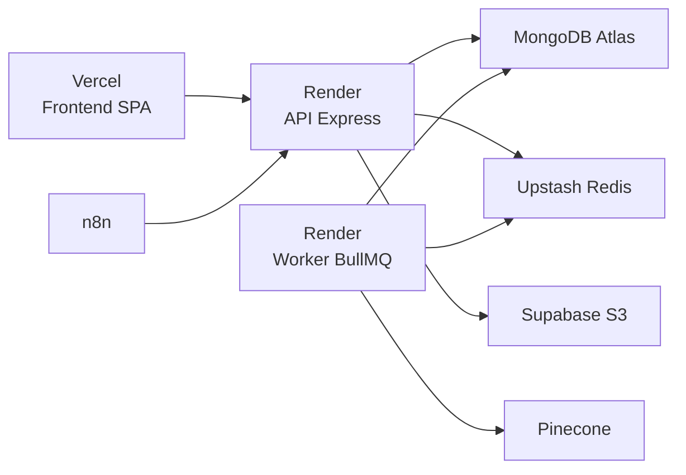
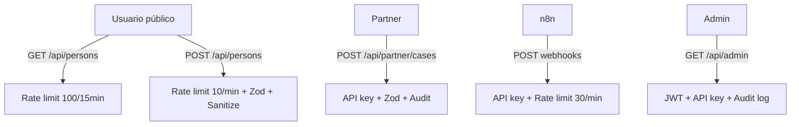

# Reencuentro Terremoto Venezuela 🇻🇪

> **Misión:** Plataforma tecnológica robusta, segura y abierta para centralizar la búsqueda de personas desaparecidas, las alertas de emergencia y el reencuentro de familias venezolanas tras desastres naturales.

[](https://www.typescriptlang.org/)
[](https://react.dev/)
[](https://nodejs.org/)
[](https://expressjs.com/)
[](https://www.mongodb.com/)
[](LICENSE)

Arquitectura de **microservicios** con Node.js + React, diseñada para resistir picos de tráfico durante emergencias. Ingestiona, limpia, deduplica y centraliza cientos de miles de reportes de múltiples fuentes en una **única fuente de verdad**, con asistencia de IA y **privacidad por diseño**.

> 🔓 **Repositorio público.** Nunca se versionan secretos, claves ni datos personales (PII). `.env` está en `.gitignore`; solo se versiona `back/.env.example`.

---

## Tabla de Contenidos

- [¿Qué hace?](#-qué-hace)
- [Stack Tecnológico](#-stack-tecnológico)
- [Arquitectura](#-arquitectura)
- [Modelo de Datos](#-modelo-de-datos)
- [Desarrollo Local](#-desarrollo-local)
- [Comandos Útiles](#-comandos-útiles)
- [Variables de Entorno](#-variables-de-entorno)
- [Despliegue](#-despliegue)
- [API](#-api)
- [Seguridad](#-seguridad)
- [Decisiones Técnicas](#-decisiones-técnicas)
- [Documentación](#-documentación)
- [Contribuir](#-contribuir)
- [Licencia](#-licencia)

---

## 🧩 ¿Qué hace?

- **Centraliza** reportes de personas (y mascotas) desaparecidas/encontradas desde múltiples fuentes (USGS, GDACS, VenezuelaReporta, WhatsApp, Telegram, partners).
- **Deduplica** automáticamente con huella criptográfica (`idHash` SHA-256): ~53.000 registros sucios → ~42.000 personas únicas.
- **Estructura** texto libre con IA (Anthropic/OpenAI/Gemini intercambiables): un reporte caótico → datos limpios.
- **Empareja** búsquedas con registros mediante matching vectorial (Pinecone/Atlas/Levenshtein), siempre con confirmación humana.
- **Protege** la privacidad: datos de contacto fuera de APIs públicas, protección especial de menores (LOPNNA), ubicación aproximada en mapas.
- **Offline-first**: service worker + IndexedDB (Dexie) para operación en emergencias con conectividad intermitente.

---

## 🛠 Stack Tecnológico

### Frontend (`front/`)

| Capa | Tecnología |
|---|---|
| UI | React 19, TypeScript 6, Vite |
| Mapas | Leaflet + React-Leaflet |
| Íconos | Lucide React |
| Estilos | CSS Modules + CSS Custom Properties (tema oscuro) |
| PWA | Service Worker + Dexie (IndexedDB) |
| HTTP | Axios con interceptors |
| Despliegue | Vercel (CDN global) |

### Backend (`back/`)

| Capa | Tecnología |
|---|---|
| Runtime | Node.js 22, TypeScript 6, Express 5 |
| BD | MongoDB 4.4, Mongoose 9, índices 2dsphere |
| Cache/Colas | Redis 7, ioredis, BullMQ 5 |
| Validación | Zod 4 (end-to-end) |
| IA | Provider pattern (Anthropic, OpenAI, Google Gemini) |
| Storage | S3-compatible (MinIO local / Supabase producción) |
| Auth | JWT + Google OAuth + API keys + CSRF double-submit |
| Workers | BullMQ (matching, IA, disaster-sync) |
| Vector search | Pinecone (opt-in) |
| Logs | Pino structured logging |
| Despliegue | Render (Web Service + Background Worker) |

### Infraestructura



---

## 🏗 Arquitectura

### Microservicios desacoplados

```
ReencuentroTerremotoVenezuela/
├── front/                     # SPA React 19 (Vercel)
│   ├── src/
│   │   ├── components/        # UI reutilizables (Button, FeedCard, Modal)
│   │   ├── pages/             # Feed, Mapa, Admin, Perfil, Login
│   │   ├── store/             # React Context (Toast, Auth, Notifications)
│   │   ├── hooks/             # Custom hooks (useDebounce, useGeolocation)
│   │   ├── db/                # Dexie IndexedDB (offline)
│   │   └── services/          # Axios client (api.ts)
│   └── package.json
│
├── back/                      # API REST + Workers (Render)
│   ├── src/
│   │   ├── controllers/       # 14 controladores (auth, person, admin...)
│   │   ├── services/          # Lógica de negocio (person, matcher, storage...)
│   │   ├── models/            # 11 modelos Mongoose
│   │   ├── middlewares/       # auth, csrf, error, validate, audit
│   │   ├── routes/            # 13 routers Express
│   │   ├── validators/        # 8 esquemas Zod
│   │   ├── workers/           # 3 workers BullMQ
│   │   ├── queues/            # 4 colas BullMQ
│   │   ├── jobs/              # 12 scrapers cron
│   │   └── adapters/          # 6 adaptadores de fuentes externas
│   └── package.json
│
├── vision/                    # Microservicio Python (análisis facial)
├── Doc/                       # Documentación completa (HTML)
├── docker-compose.yml         # Infraestructura local
├── AGENTS.md                  # Instrucciones para IA agentes
├── DEVELOPERS.md              # Guía técnica para desarrolladores
├── Integraciones.md           # Manual de integración de fuentes
└── TDD.md                     # Documento de diseño técnico
```

### Flujo de ingesta de datos

```
Fuente externa → Adaptador → Zod validation → sync-source.service → upsertPerson
                                                                         ↓
                                                                idHash dedup
                                                                         ↓
                                                            PersonModel.bulkWrite
                                                                         ↓
                                                          outbox → matching + IA
```

---

## 💾 Modelo de Datos

El núcleo es `UnifiedPerson`, un esquema único que normaliza todas las fuentes:

| Campo | Tipo | Propósito |
|---|---|---|
| `idHash` | `string` (unique) | SHA-256 determinístico para dedup |
| `name` / `normalizedName` | `string` | Nombre original / lowercase sin acentos |
| `status` | `enum` | `missing`, `found`, `deceased`, `unknown` |
| `lastSeen` | `object` | Estado, municipio, coordenadas (2dsphere), fecha |
| `embedding` | `[number]` (select:false) | Vector semántico para matching IA |
| `metadata` | `object` | source, urgencyScore, auditStatus, reportedBy |
| `data` | `Mixed` | Datos variables por fuente (origen, ficha_url) |

**Otros modelos clave:** `User`, `Match`, `DisasterEvent`, `Outbox`, `SearchRequest`, `ApiKey`, `AuditLog`, `Localizado`, `SyncState`.

---

## 🚀 Desarrollo Local

### Requisitos

- Node.js 22+, npm
- Docker + Docker Compose

### 1. Clonar e instalar

```bash
git clone https://github.com/iacastillo90/ReencuentroTerremotoVenezuela.git
cd ReencuentroTerremotoVenezuela

cp back/.env.example back/.env    # crear .env local
```

### 2. Infraestructura (Docker)

```bash
docker compose up -d    # MongoDB, Redis, MinIO
```

### 3. Backend

```bash
cd back && npm install && npm run dev
# → http://localhost:4000
```

### 4. Frontend

```bash
cd front && npm install && npm run dev
# → http://localhost:5173
```

> **Forma más rápida de probar:** crear cuenta con correo/contraseña desde la pantalla de Registro (no requiere Google OAuth).

---

## 📋 Comandos Útiles

```bash
# Backend
npm run dev              # Desarrollo con hot-reload (ts-node)
npm run build            # Compilar TypeScript → dist/
npm start                # Producción (node dist/src/server.js)
npm test                 # Tests (Jest + ts-jest + mongodb-memory-server)
npm run reconcile        # Reconciliación manual

# Frontend
npm run dev              # Vite dev server
npm run build            # Build producción
npm run preview          # Preview build

# Docker
docker compose up -d              # Iniciar infraestructura
docker compose logs -f            # Logs en vivo
docker compose down               # Detener todo

# Calidad
npm run lint             # ESLint
npx tsc --noEmit         # TypeScript check (sin output = 0 errores)
```

---

## 🔑 Variables de Entorno

Configurar en `back/.env` (basado en `back/.env.example`). **Nunca subir al repositorio.**

| Variable | Requerido | Descripción |
|---|---|---|
| `MONGO_URI` | ✅ | Conexión a MongoDB |
| `REDIS_URL` | ✅ | Conexión a Redis (colas + caché) |
| `JWT_SECRET` | ✅* | Secreto JWT (obligatorio en producción) |
| `CORS_ORIGINS` | ✅ | Orígenes CORS permitidos (coincidencia exacta) |
| `MINIO_*` | ⚠️ | Almacenamiento S3 (5 variables) |
| `AI_PROVIDER` | ⚠️ | `anthropic`, `openai` o `gemini` |
| `ANTHROPIC_API_KEY` | ⚠️ | API key de Anthropic |
| `OPENAI_API_KEY` | ⚠️ | API key de OpenAI |
| `GEMINI_API_KEY` | ⚠️ | API key de Google Gemini |
| `ADMIN_API_KEY` | ⚠️ | API key de administrador |
| `PARTNER_API_KEY` | ⚠️ | API key para partners |
| `WEBHOOK_API_KEY` | ⚠️ | Secreto para webhooks n8n |
| `ALLOW_DEV_LOGIN` | — | Login sin Google (solo dev) |
| `ALLOW_MOCK_DATA` | — | Datos mock (solo dev) |

> \* Generar JWT_SECRET: `node -e "console.log(require('crypto').randomBytes(48).toString('hex'))"`

---

## 🚢 Despliegue

| Componente | Servicio |
|---|---|
| Frontend (SPA) | **Vercel** (CDN, deploy automático desde GitHub) |
| API + Worker | **Render** (Web Service + Background Worker) |
| Base de datos | **MongoDB Atlas** |
| Caché y colas | **Upstash Redis** |
| Medios | **Supabase Storage** |
| Vector search | **Pinecone** (opt-in) |

Las variables de entorno se configuran en el panel de cada servicio.

---

## 🌐 API

### Endpoints públicos

| Método | Ruta | Descripción |
|---|---|---|
| GET | `/health` | Health check |
| GET | `/api/persons` | Listar personas (paginado, ?q=, ?status=) |
| GET | `/api/persons/counts` | Estadísticas cacheadas (TTL 5min) |
| POST | `/api/persons` | Reportar persona |
| GET | `/api/disasters/active` | Desastres activos |
| POST | `/api/search/vector` | Búsqueda semántica (embeddings) |

### Endpoints autenticados

| Método | Ruta | Auth |
|---|---|---|
| GET | `/api/persons/mine` | JWT |
| POST | `/api/contact/send` | JWT |
| POST | `/api/media` | JWT |
| POST | `/api/search-requests` | JWT |

### Endpoints de integración

| Método | Ruta | Auth |
|---|---|---|
| GET/POST | `/api/partner/cases` | `x-partner-api-key` |
| POST | `/api/localizados` | `x-partner-api-key` |
| POST | `/api/webhooks/n8n/*` | `x-webhook-api-key` |
| GET/POST | `/api/admin/*` | `x-api-key` o JWT admin |

---

## 🛡️ Seguridad

### Principios

- **Privacy by Design**: PII nunca se expone en APIs públicas
- **Zero Trust**: Validación Zod en cada input, sanitización estricta
- **Defense in Depth**: Magic bytes + rate limit + CSP + CORS exacto + CSRF

### Controles implementados

| Control | Implementación |
|---|---|
| Rate limiting | Express-rate-limit (6 niveles: 5/min a 100/15min) |
| CORS | Allowlist exacta (no sufijos, no comodines) |
| CSRF | Double-submit cookie + header |
| CSP | Helmet (report-only en producción) |
| XSS | SanitizedString (Zod) + DOMPurify (frontend) |
| NoSQL injection | Zod schemas en todos los endpoints |
| ReDoS | safeRegexQuery (max 200 chars, escape) |
| MIME forgery | file-type library + magic bytes verification |
| SSRF | DNS resolution restrictiva (microservicio vision) |
| Session hijacking | tokenVersion rotación atómica |
| Contraseñas | scrypt + timingSafeEqual |
| Cache stampede | Retry loop + Redis lock |
| PII hashing | SHA-256 para cédula y teléfono |
| Protección menores | LOPNNA: enmascaramiento público (name='Caso protegido') |

### Modelo de amenazas



### Auditoría

- Colección capped `audit_logs` (1GB / 1M documentos)
- 8 tipos de eventos + 4 niveles de severidad
- Correlation IDs distribuidos (headers + Pino child logger)

---

## ⚙️ Decisiones Técnicas

| Decisión | Alternativa | Por qué |
|---|---|---|
| **idHash SHA-256** para dedup | MongoDB ObjectId | Determinístico: misma persona desde distintas fuentes produce mismo hash |
| **Transactional Outbox** | Evento directo | Garantiza consistencia: si la BD persiste, el evento eventualmente se procesa |
| **BullMQ** sobre Redis | RabbitMQ, SQS | Redis ya está en la infra para caché; BullMQ es liviano y no requiere infra separada |
| **Provider pattern IA** | SDK fijo | Intercambiable sin cambiar código (Anthropic ↔ OpenAI ↔ Gemini) |
| **Mongoose select:false** en embeddings | Excluir en query | Previene leaks por defecto: embedding no se serializa nunca sin query explícita |
| **Magic bytes + file-type** | Solo MIME header | Previene MIME forgery: archivo renombrado .exe → .jpg no pasa |
| **CSS Modules** | CSS-in-JS, Tailwind | Performance: cero runtime, bundle pequeño, tipado con TypeScript |
| **Offline-first** con Dexie | Solo online | Emergencias sin internet: IndexedDB permite operación básica |
| **Render como Worker separado** | API + worker mismo proceso | BullMQ bloquea event loop; worker separado escala independientemente |

---

## 📚 Documentación

| Documento | Contenido |
|---|---|
| [`Doc/index.html`](Doc/index.html) | Arquitectura completa, modelo de datos, seguridad, UX/UI |
| [`DEVELOPERS.md`](DEVELOPERS.md) | Guía técnica rápida para integración |
| [`TDD.md`](TDD.md) | Documento de diseño técnico detallado |
| [`Integraciones.md`](Integraciones.md) | Manual de integración de fuentes externas |
| [`AGENTS.md`](AGENTS.md) | Instrucciones para asistentes IA |
| `back/AGENTS.md` | Instrucciones específicas del backend |
| `front/AGENTS.md` | Instrucciones específicas del frontend |
| `vision/AGENTS.md` | Instrucciones del microservicio de visión |

---

## 🤝 Contribuir

1. Fork del repositorio
2. Crear rama: `git checkout -b feature/mi-cambio`
3. Seguir convenciones de código (TypeScript strict, Zod validation, tests)
4. Cargar skills de SDD para cambios grandes: `sdd-propose` → `sdd-design` → `sdd-tasks` → `sdd-apply` → `sdd-verify`
5. Asegurar 0 errores TypeScript: `cd back && npx tsc --noEmit`
6. Asegurar tests pasan: `npm test`
7. PR con conventional commits

### Convenciones

- **Commits**: `tipo(scope): mensaje` — ej. `feat(back): add rate limiting to person routes`
- **Branch naming**: `feature/`, `fix/`, `security/`, `refactor/`
- **Idioma**: Código y documentación en español (código fuente: español, commits: inglés)

---

## 📄 Licencia

MIT. Ver archivo `LICENSE` para detalles.

---

*Reencuentro Terremoto Venezuela — Hecho con profundo compromiso técnico y humano.* 🇻🇪
